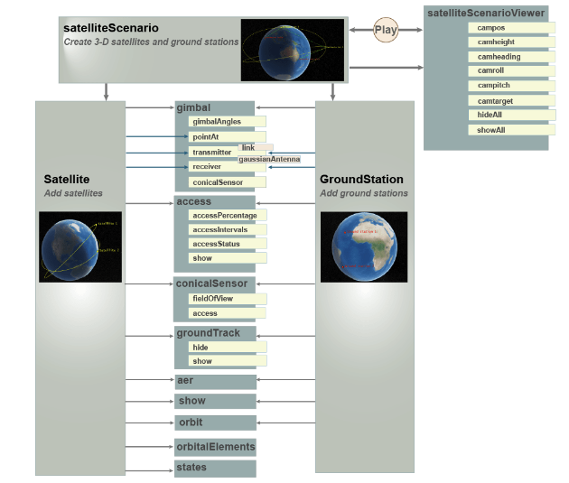

# Overview

There are 3 examples:
1. gps waveform generation
2. edn to end dvb-s2 simulation with rf impairments and awgn
3. model, visualize, and analyze satellite scenario

## Background
5 main components in the satellite scenario simulation workflow.

- satelliteScenario
- satellite
- groundStation
- satelliteScenarioViewer 
- play

