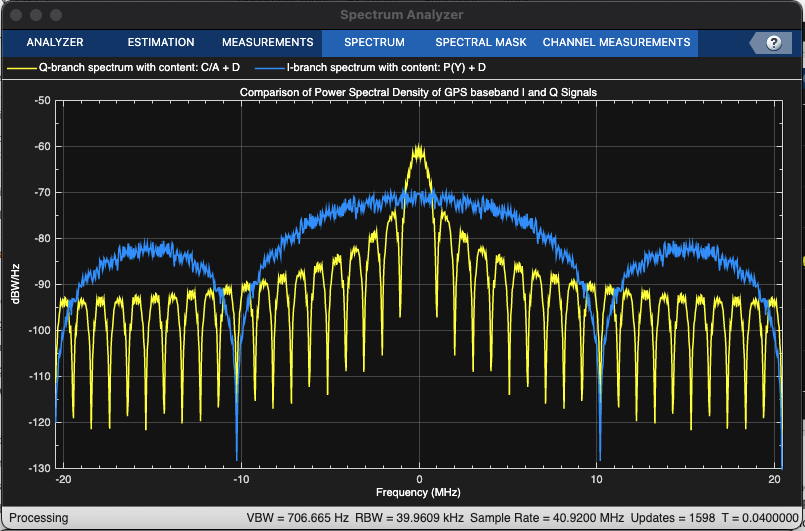

# GPS Waveform Generation Example

- in accordance with IS-GPS-200L standard
- in order to design a navigation system based on GPS, you must test the receiver with a known received signal - that's what we're generating here.

# introduction
- generate gps data bits
- spread these low data rate bits using high spreading codes
	- background: channel coding allows for a reduction of Tx Pwr by inc. sig BW through code redundancy. In multiple access comms, interference limits the performance achieved by the system. To overcome this degredation, we can increase the BW drastically - this is a characteristic of a spread-spectrum signal. In addition, the information signal at the modulator is spread in BW by means of a code that is independent of the information sequence (pseudorandom unless you are the intended receiver). (proakis and salehi 2nd ed ch 15) 
- generate the waveform from the bits that are spread by the spreading codes according to some config params. 

# gps signal structure
- L1 = 154 x 10.23 MHz = 1575.42 MHz 
- L2 = 120 x 10.23 MHz = 1227.60 MHz
- LNAV and CNAV have different frame structures
	- NAV 1500 bits long, 5 subframes - 50 bps - 6 sec per subframe, 30 sec per frame. subframe 10 words w/ 30 bits (24 data 6 parity) in each word. Data contains information regarding the clock and position of satellites.
	- CNAV transmitted continuously as message types. Each message type 300 bits long Tx'd at 25bps passed thru 1/2 rate convolutional encoder - so 600 bits at 50 bps. Tx each message takes 12 sec. 14 message types that are broadcasted in a specific order (see NAVSTAR handbook appendix 3 i don't want to type it all out) 
- psuedorandomnoise (PRN) index can be [1,63] (6 bits) 
- generating the GPS waveform for all of the data, we generate it for just one bit - this can be changed using the parameter "NumNavDataBits"

# gps data initialization
- create a config object to customize the cnav waveform as required
- ideally, all satellite clocks must be synchronized but erorrs deviate them from GPS system time
- create a config object to customize the LNAV waveform as required

# gps signal generation
- generate 50bps nav data
- generate chosen code (C/A, P, L2 CM, L2 CL, or combo)
- spread CNAV or LNAV data bit with appropriate code
- collect data for in phase and quadrature branches by rate matching 
- map bit 0 to +1 and bit 1 to -1

# signal visualization
- see figures

# further exploration
- change values in config object
- change ephemeris parameters with an existing data set
- specify your own almanac file (be sure to match week numbers in almanac and config objects) 
